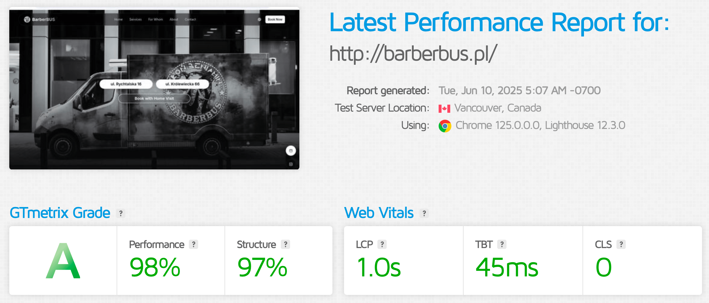
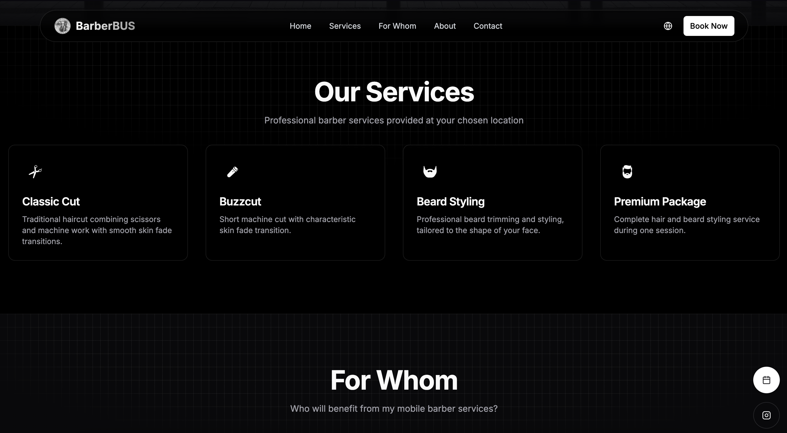
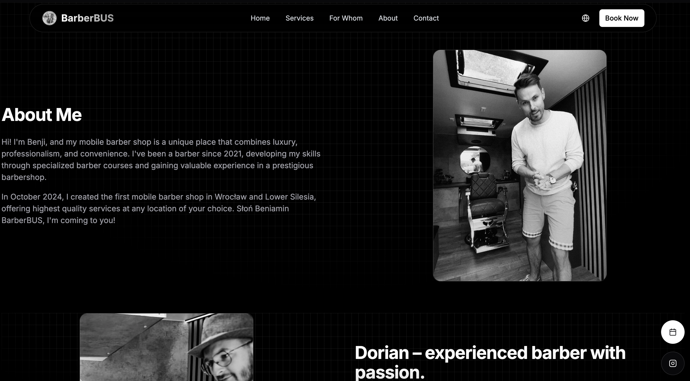
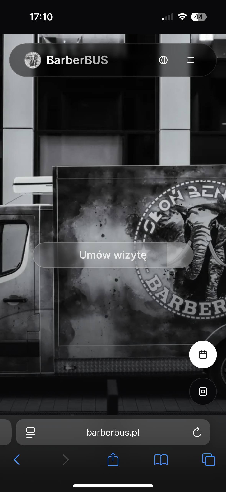
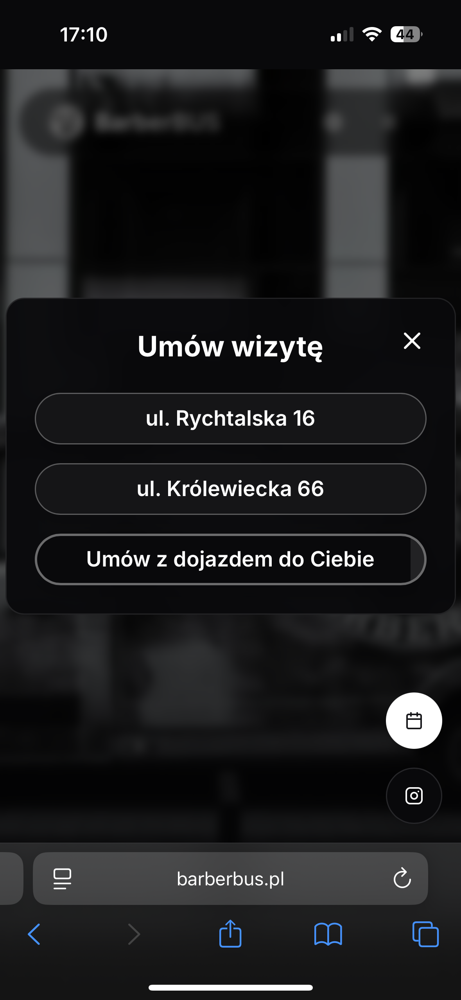

# 💈 BarberBUS - Mobile Barber Shop Website

> Mobile barber services website for Wrocław with booking system and multilingual support

[](https://barberbus.pl)
[](https://nextjs.org/)
[](https://www.typescriptlang.org/)
[](https://tailwindcss.com/)

## 🚀 Tech Stack

### **Frontend Framework**
- **Next.js 15.2.4** - React framework with App Router
- **React 18.3.1** - Component library
- **TypeScript 5.0** - Type safety

### **Styling & UI**
- **Tailwind CSS 3.4.17** - Utility-first CSS
- **Shadcn/ui** - Component library
- **Framer Motion** - Animations

### **Internationalization**
- **Next-intl 4.1.0** - Polish/English support

## 🎯 Key Business Features

**Client Requirements → Solutions Delivered:**

- **Mobile Service Booking**: Client needed online booking for mobile barber services → Built integrated booking system with location selection
- **Dual Location Support**: Required booking for 2 physical locations + mobile service → Implemented location-specific booking flows
- **International Reach**: Needed English/Polish support for Wrocław market → Added complete i18n with 2 languages
- **Professional Presence**: Wanted premium brand image → Delivered modern UI with service showcase
- **Mobile-First Users**: Target audience uses mobile devices → Built responsive design with mobile-optimized booking

**Business Impact:**
- Direct booking integration increases conversion
- Multilingual support expands customer base
- Mobile optimization targets primary user behavior
- Service showcase differentiates from competitors

## 📊 Performance Results

### Google PageSpeed Insights


### GTmetrix Analysis  


**Results:**
- **First Contentful Paint**: <1.5s
- **Largest Contentful Paint**: <2.5s
- **Core Web Vitals**: All metrics in "Good" range
- **Mobile Performance**: 90+ score
- **SEO Score**: 100/100

## 🖼️ Features Showcase

### Landing Page

*Hero section with booking CTAs and service overview*

### Services Section

*Service catalog with pricing and descriptions*

### About Section

*Barber expertise and business story*

### Mobile Experience
 
*Mobile-optimized interface and booking flow*

## ✨ Technical Features

### **Design System**
- Responsive layout for all devices
- Dark theme with consistent branding
- Smooth animations and transitions
- Accessibility compliance

### **Internationalization** 
- Dynamic Polish/English switching
- Localized content and UI
- Cookie-based locale persistence
- SEO optimization for both languages

### **Performance**
- Next.js Image optimization
- Automatic code splitting
- Core Web Vitals optimization
- Vercel deployment with analytics

## 🏗️ Project Structure

```
barber-shop/
├── app/                    # Next.js App Router
├── components/            # React components
│   ├── ui/               # Shadcn/ui components
│   └── sections/         # Page sections
├── hooks/                # Custom React hooks
├── i18n/                 # Internationalization config
├── lib/                  # Utility functions
├── messages/             # Translation files
│   ├── en/              # English translations
│   └── pl/              # Polish translations
├── public/              # Static assets
├── styles/              # Global styles
└── types/               # TypeScript definitions
```

## 🌐 Deployment

- **Production**: [barberbus.pl](https://barberbus.pl)
- **Platform**: Vercel with automatic deployments
- **Analytics**: Integrated performance monitoring

---

**Business-focused web development for BarberBUS mobile barber services**
